<p align="center">
  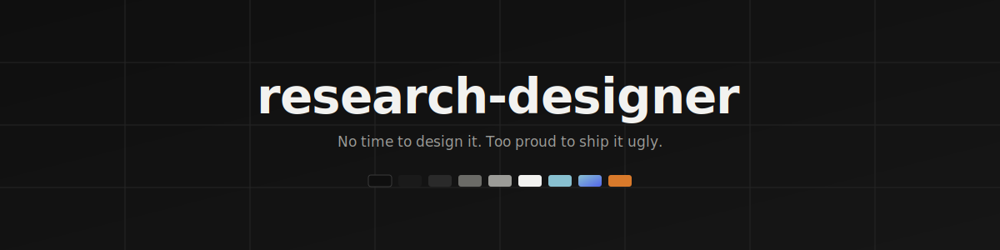
</p>
<p align="center">
  
  
  
</p>

# research-designer

**No time to design it. Too proud to ship it ugly.**

A pack of **design skills for coding agents.** Point Claude Code, Cursor, or
Codex at one spec file and get a project page, dashboard, eval UI, or poster
that doesn't look like a default template — motion and 3D included.

Agents can already build the page. What they can't do is make the design
*decisions*: type scale, color restraint, motion timing, what to leave out.
Each `themes/*.md` encodes those decisions as one self-contained spec your
agent follows exactly. 15 specs, 4 with live interactive demos (motion & 3D
don't survive a screenshot — open them).

👉 **Live gallery:** https://meow-at-me.github.io/research-designer/

<!-- GIF ROW GOES HERE once recorded — see Part 2.2 -->

## Quickstart

```bash
git clone https://github.com/meow-at-me/research-designer ~/research-designer
```

Then prompt your agent:
> Build the page as a single HTML file. Follow
> `~/research-designer/themes/experiment-dashboard.md` exactly,
> including the Don't section.

Or pin one spec to a project so "follow DESIGN.md" is the whole prompt:
```bash
cp ~/research-designer/themes/experiment-dashboard.md ./DESIGN.md
```

## Previews

Grouped by what you're building. Two views per static spec; one per live archetype. Click a caption to open its spec.

### Research & project pages

Paper / project landings, case studies and scroll-driven data stories.

<table>
<tr>
<td width="50%">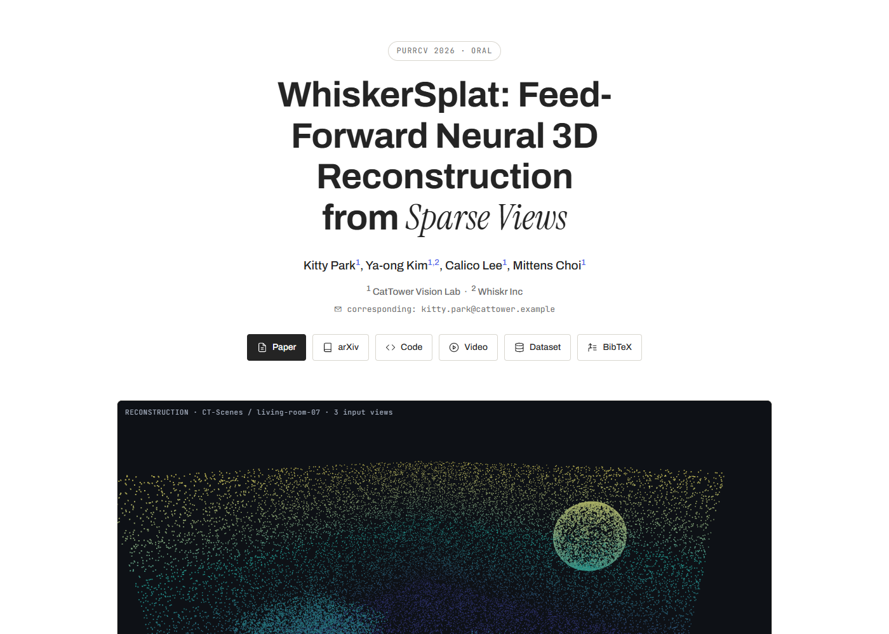<br><sub><a href="themes/research-project-page.md">themes/research-project-page.md</a></sub></td>
<td width="50%"><br><sub><a href="themes/dark-editorial-scroll.md">themes/dark-editorial-scroll.md</a></sub></td>
</tr>
<tr>
<td width="50%">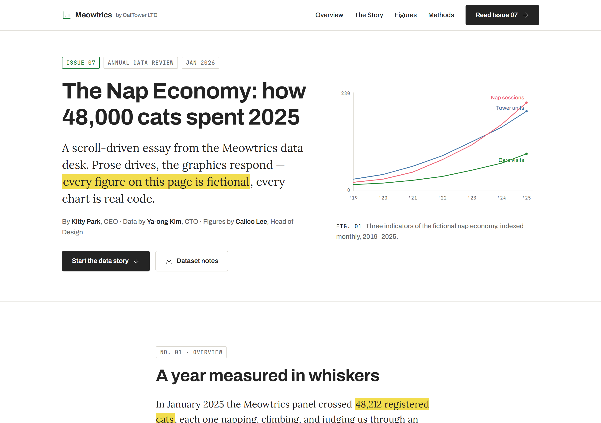<br><sub><a href="themes/scrolly-data.md">themes/scrolly-data.md</a></sub></td>
<td></td>
</tr>
</table>

### Dashboards & consoles

Metrics, ablations, run comparison and monitoring UIs.

<table>
<tr>
<td width="50%">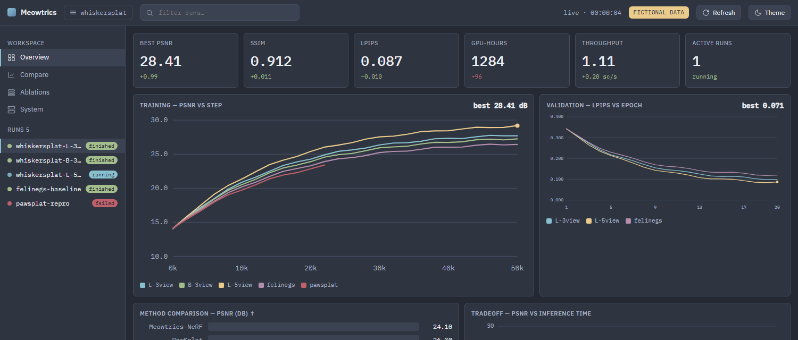<br><sub><a href="themes/experiment-dashboard.md">themes/experiment-dashboard.md</a></sub></td>
<td width="50%"><br><sub><a href="themes/aurora.md">themes/aurora.md</a></sub></td>
</tr>
<tr>
<td width="50%">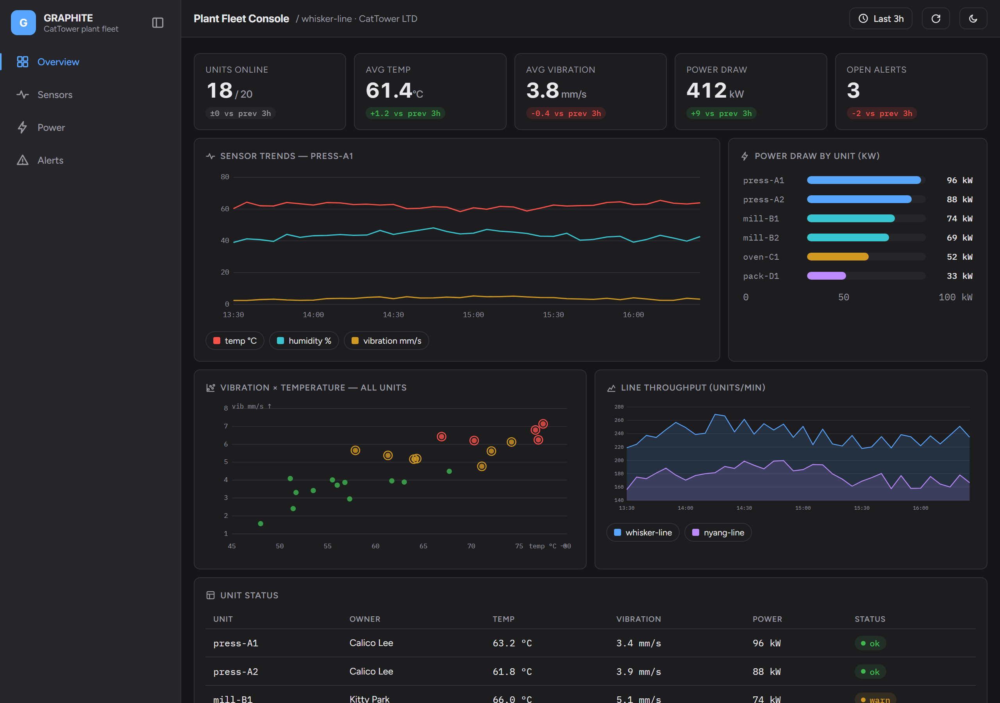<br><sub><a href="themes/graphite.md">themes/graphite.md</a></sub></td>
<td width="50%">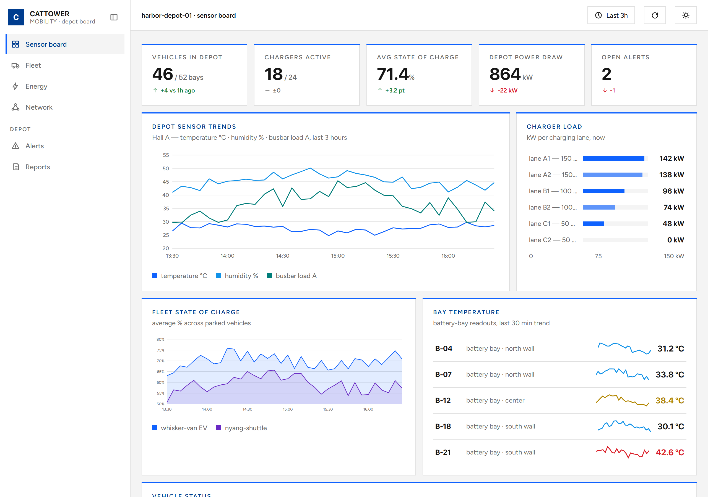<br><sub><a href="themes/marine-grid.md">themes/marine-grid.md</a></sub></td>
</tr>
<tr>
<td width="50%"><br><sub><a href="themes/lumen.md">themes/lumen.md</a></sub></td>
<td width="50%"><br><sub><a href="themes/nocturne.md">themes/nocturne.md</a></sub></td>
</tr>
<tr>
<td width="50%"><br><sub><a href="themes/pulse.md">themes/pulse.md</a></sub></td>
<td width="50%">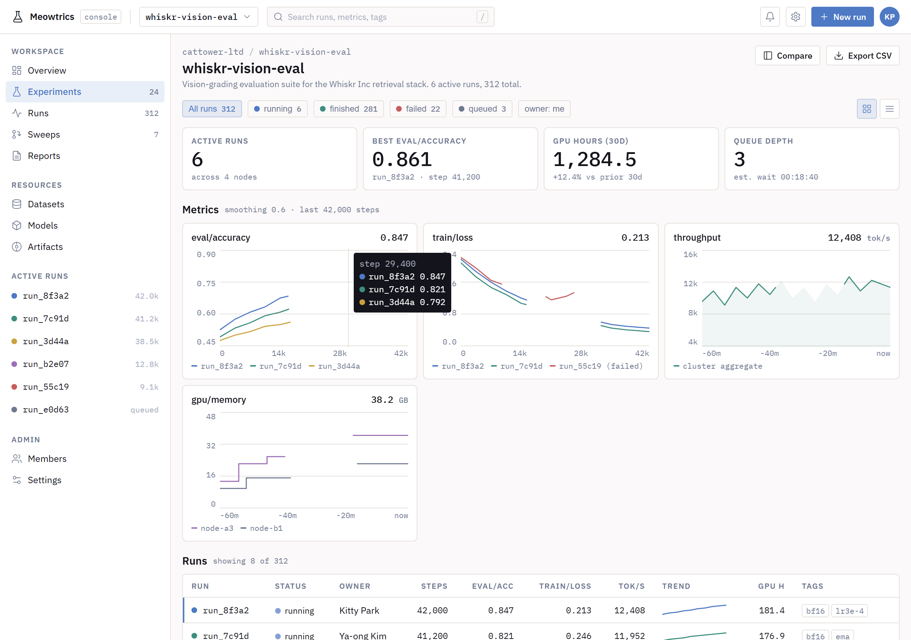<br><sub><a href="themes/lab-console.md">themes/lab-console.md</a></sub></td>
</tr>
</table>

### Annotation interfaces & posters

Human-verification / rating UIs and fixed-aspect posters (screen + print-to-PDF).

<table>
<tr>
<td width="50%">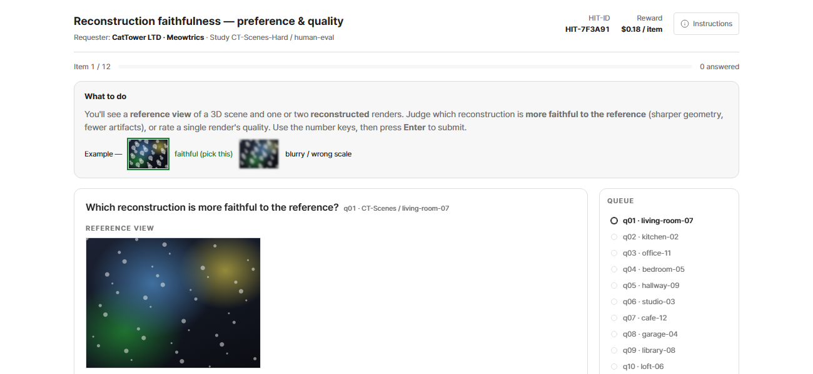<br><sub><a href="themes/eval-interface.md">themes/eval-interface.md</a></sub></td>
<td width="50%">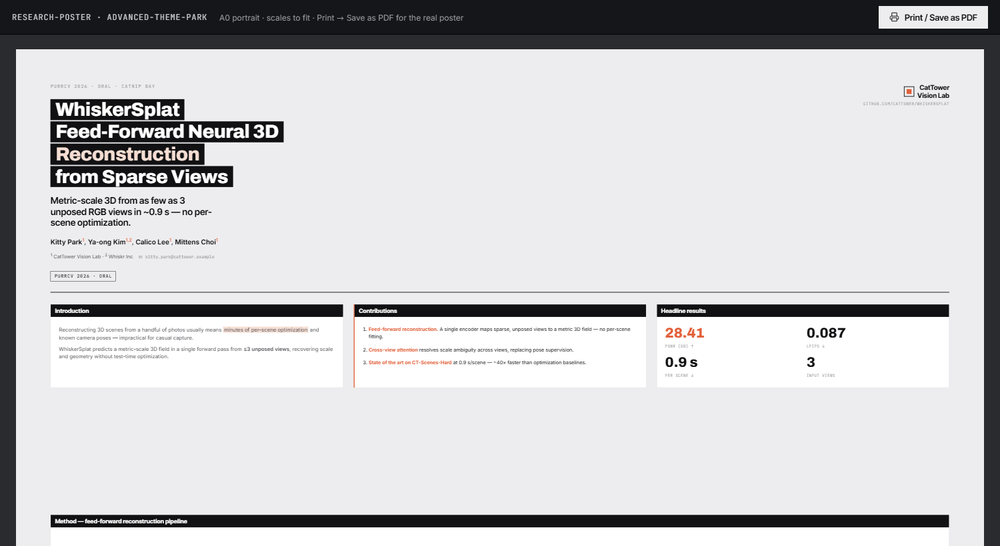<br><sub><a href="themes/research-poster.md">themes/research-poster.md</a></sub></td>
</tr>
</table>

### Motion & 3D showcase

Pure character studies — reuse their techniques inside any archetype.

<table>
<tr>
<td width="50%">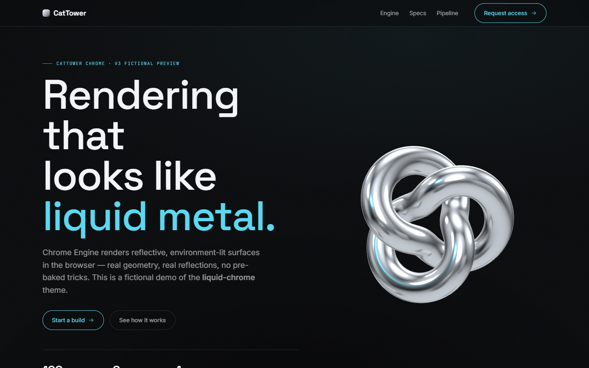<br><sub><a href="themes/liquid-chrome.md">themes/liquid-chrome.md</a></sub></td>
<td width="50%">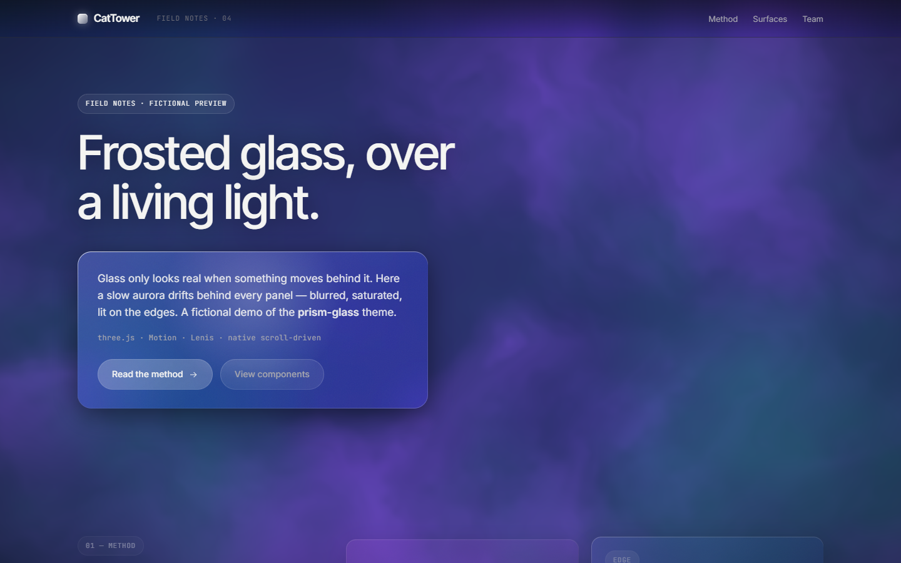<br><sub><a href="themes/prism-glass.md">themes/prism-glass.md</a></sub></td>
</tr>
</table>

> [!NOTE]
> The interactive archetype demos are published on **GitHub Pages** — open the gallery at **https://meow-at-me.github.io/research-designer/**. Static-spec previews above are screenshots rendered at 1280px.

## Themes

Each `themes/*.md` is a self-contained spec: color tokens, typography, layout, components, motion, and a Don't list. The four research archetypes pair 1:1 with an interactive demo in `examples/`; the adopted specs are static, from the `theme-park.md` vocabulary.

### Research & project pages

| Spec | What it is |
|---|---|
| `themes/research-project-page.md` | Paper / project landing: title, authors, abstract, interactive 3D teaser, method, results, BibTeX — Tier 2 (three.js) |
| `themes/dark-editorial-scroll.md` | Research/paper landing, sticky title column, bright figure cards on near-black |
| `themes/scrolly-data.md` | Light scroll-driven data essay, serif editorial voice, live charts |

### Dashboards & consoles

Collection-wide rule: every chart datapoint is **traceable to its source log line** — hover a point and the tooltip shows the exact `file:line` it came from. Wired into all eight dashboard demos.

| Spec | What it is |
|---|---|
| `themes/experiment-dashboard.md` | Metrics, ablations & run comparison — charts, KPI cards, readouts; hover any point for its source `file:line` — Tier 1 (Motion) |
| `themes/aurora.md` | Light analytics dashboard, dark sidebar, purple accent, donut/bar viz |
| `themes/graphite.md` | Matte charcoal industrial console, color only in data, ink-in reveal |
| `themes/marine-grid.md` | Square-corner corporate sensor board, deep marine blue, hairline panels |
| `themes/lumen.md` | Navy instrument panel, radial gauges, uniform-ramp heatmaps, mono readouts |
| `themes/nocturne.md` | Dense slate night-ops board, frost accent, packed 12-col panels |
| `themes/pulse.md` | Consumer-soft monitor, one blue, springy count-ups, large rounded cards |
| `themes/lab-console.md` | Light engineering console, dense run tables, live metrics |

### Annotation interfaces & posters

| Spec | What it is |
|---|---|
| `themes/eval-interface.md` | Human-verification / MTurk-style annotation & rating UI, keyboard-first A/B + Likert — Tier 0 |
| `themes/research-poster.md` | Fixed-aspect A0 poster — renders on screen *and* prints to PDF in one system — Tier 0 |

### Motion & 3D showcase

| Spec | What it is |
|---|---|
| `themes/liquid-chrome.md` | Near-black premium; a real chrome torus-knot (three.js + RoomEnvironment) — Tier 2 |
| `themes/prism-glass.md` | Frosted glass over a living fbm-aurora shader (three.js) — Tier 2 |

## Approach: three-tier progressive enhancement

| Tier | Layer | Dependencies |
|---|---|---|
| 0 | Native CSS scroll-driven animations + View Transitions + WAAPI | none |
| 1 | Motion orchestration — **Motion** (default), **GSAP** when SplitText/ScrollTrigger is needed | CDN, pinned + SRI |
| 2 | Real 3D — **three.js** (custom scenes), `<model-viewer>` (drop-in), OGL/curtains (shader backgrounds) | CDN, pinned + SRI |

Every live spec declares the highest tier it uses, and reaches for Tier 1/2 only when motion or 3D is core to the task — never as decoration. Static specs are Tier 0 by definition. All third-party libraries are MIT / Apache / free-for-commercial; see [`TOOLING.md`](TOOLING.md) for the tool catalog + license verdicts, [`GUIDELINES.md`](GUIDELINES.md) for the standing rules, and [`LICENSES.md`](LICENSES.md) for the dependency manifest.

## Usage

```
git clone https://github.com/meow-at-me/research-designer ~/research-designer
```

Then, from any project, prompt your assistant:

> Build the page as a single HTML file.
> Follow `~/research-designer/themes/experiment-dashboard.md` exactly, including the Don't section.

Optionally pin a spec to a project: `cp ~/research-designer/themes/experiment-dashboard.md ./DESIGN.md` — then "follow DESIGN.md" is the whole prompt. Live archetype demos open at the [GitHub Pages gallery](https://meow-at-me.github.io/research-designer/).

> [!IMPORTANT]
> One spec per page. Mixing two defeats the purpose.

## Repo layout

```
index.html     landing / gallery page (GitHub Pages root)
themes/        specs (.md), one per page — live archetypes + showcase + adopted static specs
examples/      self-contained interactive demos (.html), 1:1 with the live specs — published as live pages
shared/tokens/ DTCG design tokens (primitive + semantic) — source of truth for shared values
build/         generated CSS variables (build/variables.css) — demos inline a copy
assets/        self-made or CC0 assets only — previews, 3D models, lottie, banner
GUIDELINES.md  standing rules · TOOLING.md  external-tool catalog · LICENSES.md  dependency manifest
```

Shared values (durations, easings, colors, radii, spacing) live as **DTCG design tokens** in `shared/tokens/` and build to CSS custom properties with **Style Dictionary** (`npm run build:tokens` → `build/variables.css`). This is **additive** — demos stay single self-contained HTML and inline a copy, so nothing needs a build to open. See [`shared/tokens/README.md`](shared/tokens/README.md) and [`TOKENS_STUDIO_HANDOFF.md`](TOKENS_STUDIO_HANDOFF.md).

## License

Docs: CC BY 4.0 · Code samples: MIT · Third-party libraries: see [`LICENSES.md`](LICENSES.md).
Independent design-pattern study. Not affiliated with any company; no brand assets included;
all demo content (people, companies, datasets, venues, and metrics) is fictional.
