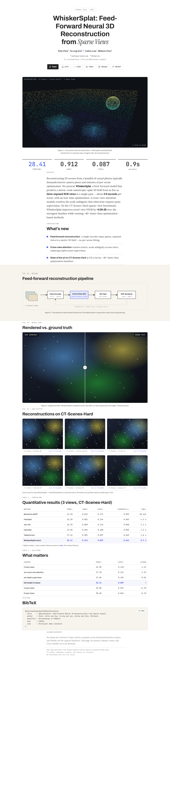
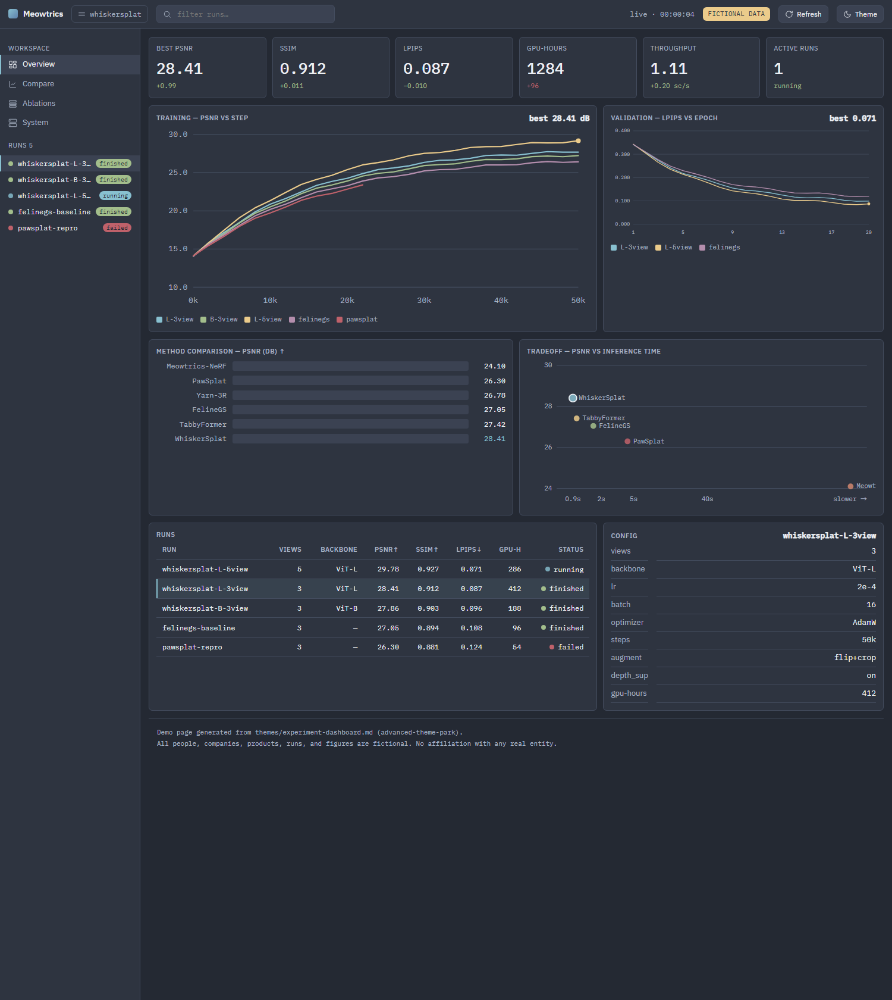
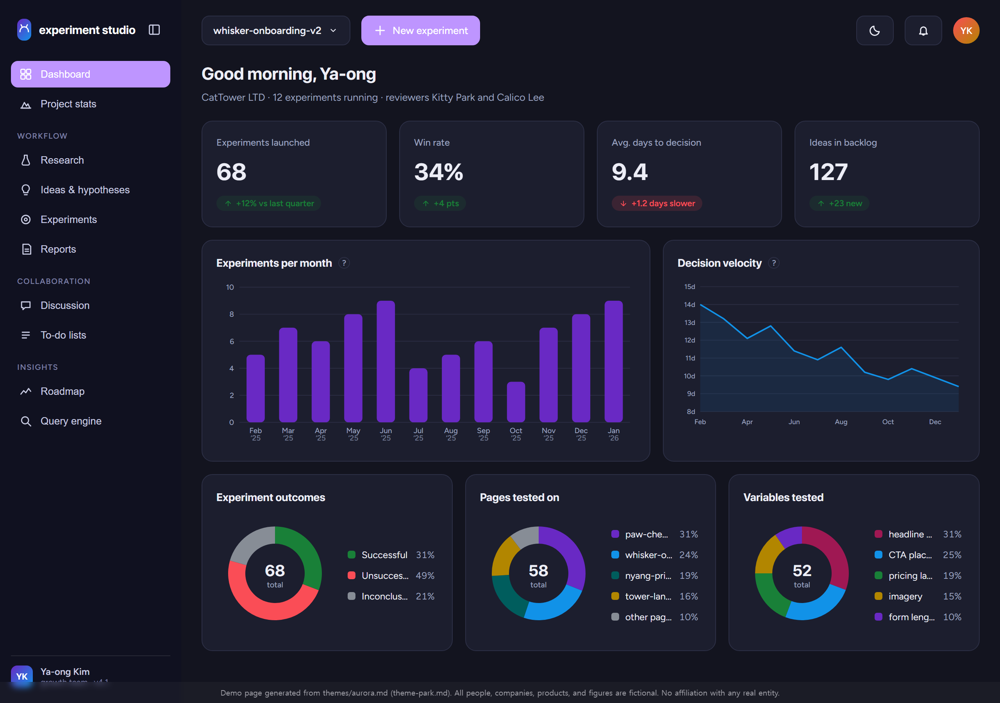
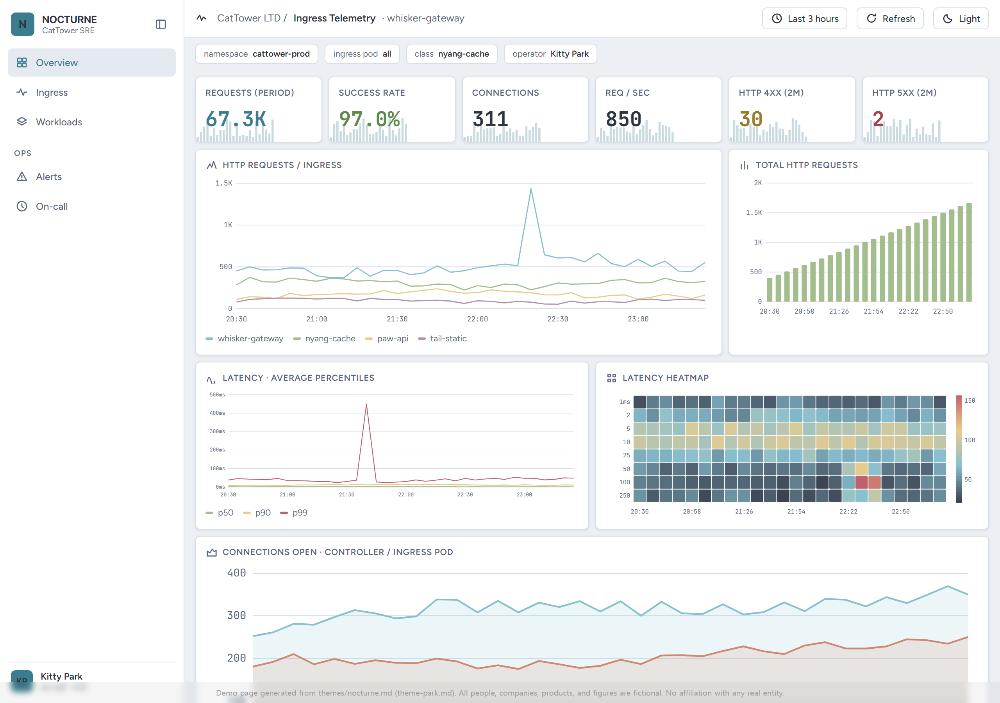
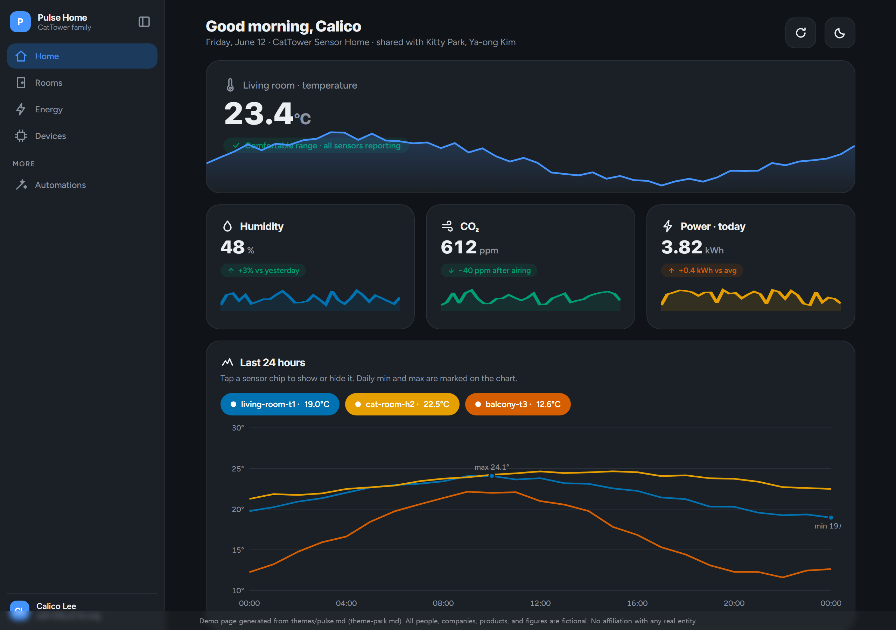
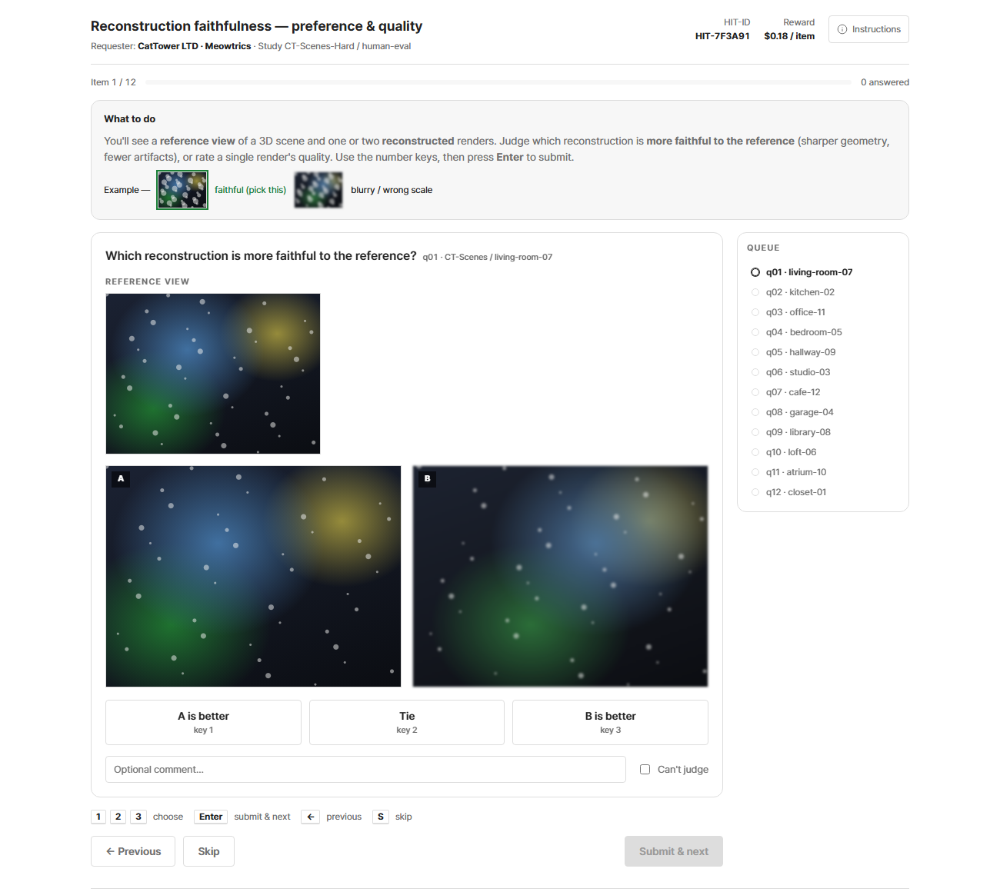
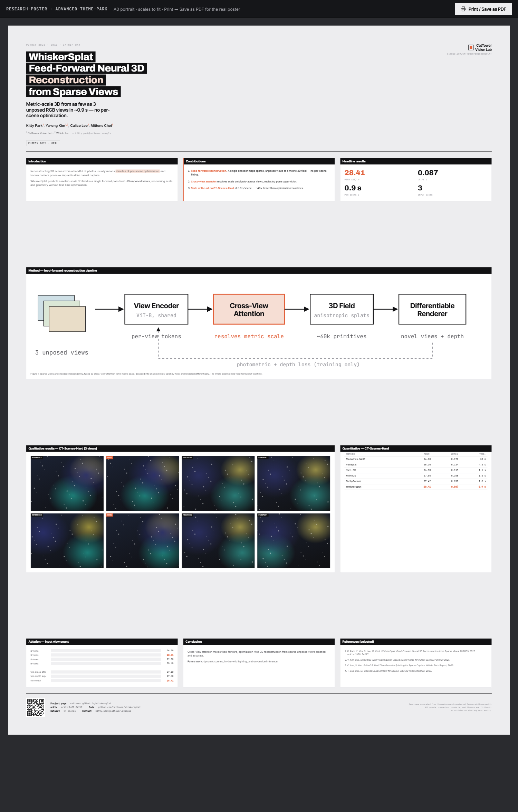
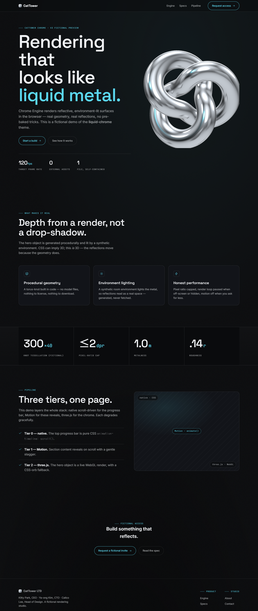
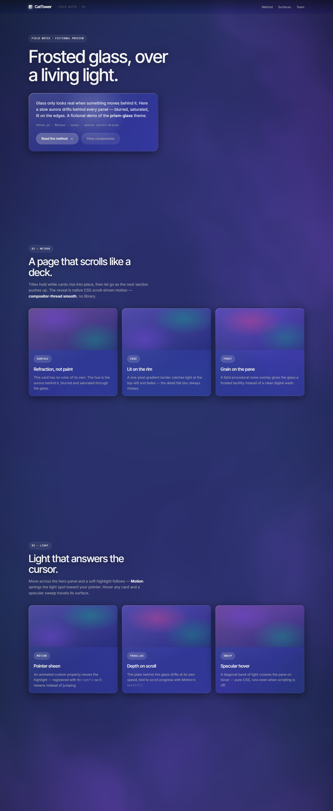

<p align="center">
  
</p>
<p align="center">
  
  
  
</p>

# research-designer

**No time to design it. Too proud to ship it ugly.**

Page specs **for researchers and engineers** who have no time to refine design but can't stand an ugly dashboard, eval UI, or project page. Four research **archetypes** each ship a self-contained spec **plus a live demo** — motion and 3D can't be conveyed in a screenshot, so they're meant to be *opened*. Alongside them, a set of **static dashboard / research-page specs** (adopted from the sibling `theme-park.md` vocabulary) cover the same surfaces when you don't need motion.

> [!NOTE]
> Sibling project: `theme-park.md` focuses on HTML / shape / color in static Markdown specs. This repo extends that vocabulary into **kinetic and 3D** research surfaces — and re-uses its best static dashboard / research-page specs as-is.

## Previews

Grouped by what you're building. **▶ marks a live, openable motion/3D demo** (these are the product — open them, the motion is the point). The rest are **static specs** shown as screenshots — two views each (hero + a section below the fold; dashboards show the opposite colour scheme).

### Research & project pages

Paper / project landings, case studies and scroll-driven data stories.

<table>
<tr>
<td width="50%"><br><sub><a href="examples/research-project-page.html">▶ research-project-page</a> · <a href="themes/research-project-page.md">spec</a></sub></td>
<td width="50%"><br><sub><a href="themes/dark-editorial-scroll.md">themes/dark-editorial-scroll.md</a></sub></td>
</tr>
<tr>
<td width="50%"><br><sub><a href="themes/scrolly-data.md">themes/scrolly-data.md</a></sub></td>
<td></td>
</tr>
</table>

### Dashboards & consoles

Metrics, ablations, run comparison and monitoring UIs.

<table>
<tr>
<td width="50%"><br><sub><a href="examples/experiment-dashboard.html">▶ experiment-dashboard</a> · <a href="themes/experiment-dashboard.md">spec</a></sub></td>
<td width="50%"><br><sub><a href="themes/aurora.md">themes/aurora.md</a></sub></td>
</tr>
<tr>
<td width="50%"><br><sub><a href="themes/graphite.md">themes/graphite.md</a></sub></td>
<td width="50%"><br><sub><a href="themes/marine-grid.md">themes/marine-grid.md</a></sub></td>
</tr>
<tr>
<td width="50%"><br><sub><a href="themes/lumen.md">themes/lumen.md</a></sub></td>
<td width="50%"><br><sub><a href="themes/nocturne.md">themes/nocturne.md</a></sub></td>
</tr>
<tr>
<td width="50%"><br><sub><a href="themes/pulse.md">themes/pulse.md</a></sub></td>
<td width="50%"><br><sub><a href="themes/lab-console.md">themes/lab-console.md</a></sub></td>
</tr>
</table>

### Annotation interfaces & posters

Human-verification / rating UIs and fixed-aspect posters (screen + print-to-PDF).

<table>
<tr>
<td width="50%"><br><sub><a href="examples/eval-interface.html">▶ eval-interface</a> · <a href="themes/eval-interface.md">spec</a></sub></td>
<td width="50%"><br><sub><a href="examples/research-poster.html">▶ research-poster</a> · <a href="themes/research-poster.md">spec</a></sub></td>
</tr>
</table>

### Motion & 3D showcase

Pure character studies — reuse their techniques inside any archetype.

<table>
<tr>
<td width="50%"><br><sub><a href="examples/liquid-chrome.html">▶ liquid-chrome</a> · <a href="themes/liquid-chrome.md">spec</a></sub></td>
<td width="50%"><br><sub><a href="examples/prism-glass.html">▶ prism-glass</a> · <a href="themes/prism-glass.md">spec</a></sub></td>
</tr>
</table>

> [!NOTE]
> Live demos (▶) are published on **GitHub Pages** — open the [gallery](https://meow-at-me.github.io/research-designer/). Static-spec previews are screenshots rendered at 1280px.

## Themes

Each `themes/*.md` is a self-contained spec: color tokens, typography, layout, components, motion, and a Don't list. **Live** specs pair 1:1 with an interactive demo in `examples/`; **static** specs are screenshot-only, adopted from the `theme-park.md` vocabulary.

### Research & project pages

| Spec | What it is | Demo |
|---|---|---|
| `themes/research-project-page.md` | Paper / project landing: title, authors, abstract, interactive 3D teaser, method, results, BibTeX | [▶ live](examples/research-project-page.html) · Tier 2 (three.js) |
| `themes/dark-editorial-scroll.md` | Research/paper landing, sticky title column, bright figure cards on near-black | static spec |
| `themes/scrolly-data.md` | Light scroll-driven data essay, serif editorial voice, live charts | static spec |

### Dashboards & consoles

| Spec | What it is | Demo |
|---|---|---|
| `themes/experiment-dashboard.md` | Metrics, ablations & run comparison — charts, KPI cards, readouts | [▶ live](examples/experiment-dashboard.html) · Tier 1 (Motion) |
| `themes/aurora.md` | Light analytics dashboard, dark sidebar, purple accent, donut/bar viz | static spec |
| `themes/graphite.md` | Matte charcoal industrial console, color only in data, ink-in reveal | static spec |
| `themes/marine-grid.md` | Square-corner corporate sensor board, deep marine blue, hairline panels | static spec |
| `themes/lumen.md` | Navy instrument panel, radial gauges, uniform-ramp heatmaps, mono readouts | static spec |
| `themes/nocturne.md` | Dense slate night-ops board, frost accent, packed 12-col panels | static spec |
| `themes/pulse.md` | Consumer-soft monitor, one blue, springy count-ups, large rounded cards | static spec |
| `themes/lab-console.md` | Light engineering console, dense run tables, live metrics | static spec |

### Annotation interfaces & posters

| Spec | What it is | Demo |
|---|---|---|
| `themes/eval-interface.md` | Human-verification / MTurk-style annotation & rating UI, keyboard-first A/B + Likert | [▶ live](examples/eval-interface.html) · Tier 0 (View Transitions) |
| `themes/research-poster.md` | Fixed-aspect A0 poster — renders on screen *and* prints to PDF in one system | [▶ live](examples/research-poster.html) · Tier 0 |

### Motion & 3D showcase

| Spec | What it is | Demo |
|---|---|---|
| `themes/liquid-chrome.md` | Near-black premium; a real chrome torus-knot (three.js + RoomEnvironment) | [▶ live](examples/liquid-chrome.html) · Tier 2 |
| `themes/prism-glass.md` | Frosted glass over a living fbm-aurora shader (three.js) | [▶ live](examples/prism-glass.html) · Tier 2 |

## Approach: three-tier progressive enhancement

| Tier | Layer | Dependencies |
|---|---|---|
| 0 | Native CSS scroll-driven animations + View Transitions + WAAPI | none |
| 1 | Motion orchestration — **Motion** (default), **GSAP** when SplitText/ScrollTrigger is needed | CDN, pinned + SRI |
| 2 | Real 3D — **three.js** (custom scenes), `<model-viewer>` (drop-in), OGL/curtains (shader backgrounds) | CDN, pinned + SRI |

Every live spec declares the highest tier it uses, and reaches for Tier 1/2 only when motion or 3D is core to the task — never as decoration. Static specs are Tier 0 by definition. All third-party libraries are MIT / Apache / free-for-commercial; see [`TOOLING.md`](TOOLING.md) for the tool catalog + license verdicts, [`GUIDELINES.md`](GUIDELINES.md) for the standing rules, and [`LICENSES.md`](LICENSES.md) for the dependency manifest.

## Usage

```
git clone https://github.com/meow-at-me/research-designer ~/research-designer
```

Then, from any project, prompt your assistant:

> Build the page as a single HTML file.
> Follow `~/research-designer/themes/experiment-dashboard.md` exactly, including the Don't section.

Optionally pin a spec to a project: `cp ~/research-designer/themes/experiment-dashboard.md ./DESIGN.md` — then "follow DESIGN.md" is the whole prompt.

> [!IMPORTANT]
> One spec per page. Mixing two defeats the purpose.

## Repo layout

```
index.html     landing / gallery page (GitHub Pages root)
themes/        specs (.md), one per page — live archetypes + showcase + adopted static specs
examples/      self-contained interactive demos (.html), 1:1 with the live specs — published as live pages
shared/tokens/ DTCG design tokens (primitive + semantic) — source of truth for shared values
build/         generated CSS variables (build/variables.css) — demos inline a copy
assets/        self-made or CC0 assets only — previews, 3D models, lottie, banner
GUIDELINES.md  standing rules · TOOLING.md  external-tool catalog · LICENSES.md  dependency manifest
```

Shared values (durations, easings, colors, radii, spacing) live as **DTCG design tokens** in `shared/tokens/` and build to CSS custom properties with **Style Dictionary** (`npm run build:tokens` → `build/variables.css`). This is **additive** — demos stay single self-contained HTML and inline a copy, so nothing needs a build to open. See [`shared/tokens/README.md`](shared/tokens/README.md) and [`TOKENS_STUDIO_HANDOFF.md`](TOKENS_STUDIO_HANDOFF.md).

## License

Docs: CC BY 4.0 · Code samples: MIT · Third-party libraries: see [`LICENSES.md`](LICENSES.md).
Independent design-pattern study. Not affiliated with any company; no brand assets included;
all demo content (people, companies, datasets, venues, and metrics) is fictional.
